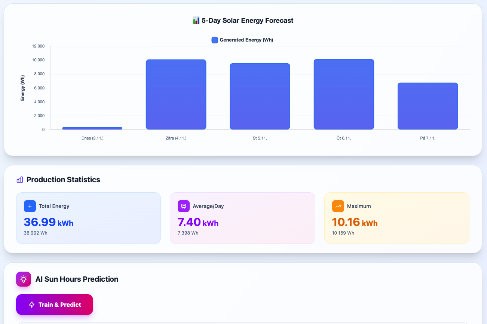

# 🌞 Solar Gain Predictor

[🇬🇧 English](#english) | [🇨🇿 Čeština](#čeština)

---

<a name="english"></a>
## 🇬🇧 English

A web application that predicts solar energy production (in Wh/kWh) based on real weather data and AI technology. The app uses panel parameters (area, efficiency, roof orientation), integrates real-time and historical weather data from Open-Meteo API, and leverages TensorFlow.js for AI-powered predictions.

### 🚀 Features
- **Bilingual interface** (Czech/English) with localStorage persistence
- **City search with autocomplete** - Smart city suggestions with coordinates
- **Geolocation support** - Use your current location automatically
- **Real weather data** - Integration with Open-Meteo API for historical and forecast data
- **5-day energy forecast** - Daily energy production predictions
- **Interactive visualizations** - Beautiful charts with Chart.js
- **AI-powered predictions** - TensorFlow.js model trained on 180 days of historical data
- **Comparison view** - Actual forecast vs. AI predictions
- **Roof orientation calculator** - Optimal positioning recommendations
- **Production statistics** - Total energy, daily average, and maximum production

### 🧰 Technologies Used
- **React** - UI library
- **Vite** - Fast build tool and dev server
- **Tailwind CSS** - Utility-first CSS framework
- **Chart.js** + **react-chartjs-2** - Interactive data visualization
- **TensorFlow.js** - Machine learning in the browser
- **Open-Meteo API** - Free historical and forecast weather data
- **OpenWeatherMap API** - Geocoding and city search

### 🧱 Project Structure
```
src/
 ├─ App.jsx                      # Main application component
 ├─ components/
 │   ├─ SolarForm.jsx           # Input form with city autocomplete
 │   └─ SolarChart.jsx          # Energy visualization chart
 ├─ services/
 │   ├─ openMeteoService.js     # Open-Meteo API integration
 │   ├─ weatherService.js       # OpenWeatherMap geocoding
 │   └─ aiModel.js              # TensorFlow.js ML model
 ├─ data/
 │   └─ simulateSolarData.js    # Energy calculation logic
 └─ i18n/
     ├─ LanguageContext.jsx     # i18n context provider
     └─ translations.js         # CZ/EN translations
```

### ⚙️ Installation and Setup

1. **Clone the repository**
   ```bash
   git clone https://github.com/TomasDevs/solar-gain-predictor.git
   cd solar-gain-predictor
   ```

2. **Install dependencies**
   ```bash
   npm install
   ```

3. **Set up environment variables**

   Create a `.env` file in the root directory:
   ```env
   VITE_OPENWEATHER_API_KEY=your_openweathermap_api_key_here
   ```

   Get your free API key at [OpenWeatherMap](https://openweathermap.org/api)

   **Note:** Open-Meteo API doesn't require an API key!

4. **Run the project**
   ```bash
   npm run dev
   ```

The app will be available at `http://localhost:5173` (or another port if 5173 is in use).

### 🧮 Energy Calculation Formula
```
energy (Wh) = panel_area (m²) × efficiency (0-1) × sun_hours × orientation_factor × 1000
```

**Orientation factors:**
- South: 1.0 (100% - optimal)
- Southeast/Southwest: 0.9 (90%)
- East/West: 0.75 (75%)
- North: 0.5 (50%)

Sun hours are obtained from **Open-Meteo API** which provides:
- Historical data: 180 days (6 months) for AI training
- Forecast data: 7 days with sunshine duration, cloud coverage, and temperature

### 🤖 AI Prediction (TensorFlow.js)
The application uses TensorFlow.js to train a neural network that:
- **Trains on 180 days** of real historical weather data from Open-Meteo API
- **Learns patterns** between month, day of year, temperature, cloudiness, and sun hours
- **Predicts sun hours** for the next 5 days based on learned patterns
- **Compares predictions** with current Open-Meteo forecast
- **Trains locally** in the browser for privacy (no server required)

The model architecture:
- Input layer: 4 features (month, day of year, temperature, cloudiness)
- Hidden layers: Dense layers with ReLU activation
- Output layer: Sun hours prediction
- Training: Adam optimizer with MSE loss

Users can trigger model training with the "Train & Predict" button, which processes 6 months of historical weather data.

### 🌐 Internationalization (i18n)
The app supports two languages with full translations:
- **Czech (cs)** - Default language
- **English (en)** - Full English translation

Features:
- Language switcher in header (CZ/EN buttons)
- Persisted in localStorage
- Localized city names (Praha → Prague)
- Translated UI, forms, charts, and error messages
- Dynamic document title based on language

### 🌤️ Weather Integration

**Open-Meteo API** (Primary data source):
- Historical weather data (180 days)
- 7-day forecast
- Sunshine duration, cloud coverage, temperature
- **No API key required** - Free and open

**OpenWeatherMap API** (Geocoding only):
- City search and autocomplete
- Coordinates lookup
- Localized city names

### 🎨 UI/UX Features
- **Responsive design** - Mobile-first approach with Tailwind CSS
- **Gradient backgrounds** - Modern glassmorphism effects
- **Interactive charts** - Tooltips with detailed energy metrics
- **Loading states** - User feedback during API calls
- **Error handling** - Fallback to simulated data if API fails
- **Smart autocomplete** - Debounced city search with coordinates display
- **Geolocation** - One-click location detection

### 📸 Screenshot



Don't forget to add environment variables in your deployment platform settings!

### 📄 License
MIT License

---

<a name="čeština"></a>
## 🇨🇿 Čeština

Webová aplikace pro predikci výroby solární energie (v Wh/kWh) založená na reálných datech o počasí a AI technologii. Aplikace využívá parametry panelu (plocha, účinnost, orientace střechy), integruje historická a předpovědní data z Open-Meteo API a využívá TensorFlow.js pro AI predikce.

### 🚀 Funkce
- **Dvojjazyčné rozhraní** (čeština/angličtina) s uložením preference
- **Vyhledávání měst s našeptávačem** - Chytré návrhy měst včetně souřadnic
- **Podpora geolokace** - Automatické použití vaší aktuální polohy
- **Reálná data o počasí** - Integrace s Open-Meteo API pro historická a předpovědní data
- **5denní předpověď energie** - Denní predikce výroby energie
- **Interaktivní vizualizace** - Krásné grafy s Chart.js
- **AI predikce** - TensorFlow.js model natrénovaný na 180 dnech historických dat
- **Porovnání** - Skutečná předpověď vs. AI predikce
- **Kalkulačka orientace střechy** - Doporučení optimálního umístění
- **Statistiky výroby** - Celková energie, denní průměr a maximum

### 🧰 Použité technologie
- **React** - UI knihovna
- **Vite** - Rychlý build nástroj a dev server
- **Tailwind CSS** - Utility-first CSS framework
- **Chart.js** + **react-chartjs-2** - Interaktivní vizualizace dat
- **TensorFlow.js** - Strojové učení v prohlížeči
- **Open-Meteo API** - Zdarma historická a předpovědní data o počasí
- **OpenWeatherMap API** - Geokódování a vyhledávání měst

### 🧱 Struktura projektu
```
src/
 ├─ App.jsx                      # Hlavní komponenta aplikace
 ├─ components/
 │   ├─ SolarForm.jsx           # Vstupní formulář s našeptávačem měst
 │   └─ SolarChart.jsx          # Graf vizualizace energie
 ├─ services/
 │   ├─ openMeteoService.js     # Integrace Open-Meteo API
 │   ├─ weatherService.js       # OpenWeatherMap geokódování
 │   └─ aiModel.js              # TensorFlow.js ML model
 ├─ data/
 │   └─ simulateSolarData.js    # Logika výpočtu energie
 └─ i18n/
     ├─ LanguageContext.jsx     # i18n context provider
     └─ translations.js         # CZ/EN překlady
```

### ⚙️ Instalace a spuštění

1. **Klonuj repozitář**
   ```bash
   git clone https://github.com/TomasDevs/solar-gain-predictor.git
   cd solar-gain-predictor
   ```

2. **Instaluj závislosti**
   ```bash
   npm install
   ```

3. **Nastav environment proměnné**

   Vytvoř soubor `.env` v kořenovém adresáři:
   ```env
   VITE_OPENWEATHER_API_KEY=tvuj_openweathermap_api_klic
   ```

   Získej API klíč zdarma na [OpenWeatherMap](https://openweathermap.org/api)

   **Poznámka:** Open-Meteo API nevyžaduje API klíč!

4. **Spusť projekt**
   ```bash
   npm run dev
   ```

Aplikace bude dostupná na `http://localhost:5173` (nebo na jiném portu, pokud je 5173 obsazený).

### 🧮 Vzorec výpočtu energie
```
energie (Wh) = plocha_panelu (m²) × účinnost (0-1) × sluneční_hodiny × orientační_faktor × 1000
```

**Orientační faktory:**
- Jih: 1.0 (100% - optimální)
- Jihovýchod/Jihozápad: 0.9 (90%)
- Východ/Západ: 0.75 (75%)
- Sever: 0.5 (50%)

Sluneční hodiny jsou získány z **Open-Meteo API**, které poskytuje:
- Historická data: 180 dní (6 měsíců) pro AI trénování
- Předpovědní data: 7 dní s délkou slunečního svitu, oblačností a teplotou

### 🤖 AI Predikce (TensorFlow.js)
Aplikace využívá TensorFlow.js k trénování neuronové sítě, která:
- **Trénuje na 180 dnech** reálných historických dat o počasí z Open-Meteo API
- **Učí se vzory** mezi měsícem, dnem v roce, teplotou, oblačností a slunečními hodinami
- **Predikuje sluneční hodiny** pro následujících 5 dní na základě naučených vzorů
- **Porovnává predikce** s aktuální Open-Meteo předpovědí
- **Trénuje lokálně** v prohlížeči pro soukromí (není potřeba server)

Architektura modelu:
- Vstupní vrstva: 4 features (měsíc, den v roce, teplota, oblačnost)
- Skryté vrstvy: Dense vrstvy s ReLU aktivací
- Výstupní vrstva: Predikce slunečních hodin
- Trénování: Adam optimizér s MSE loss funkcí

Uživatelé mohou spustit trénování modelu tlačítkem "Natrénovat & Predikovat", které zpracuje 6 měsíců historických dat o počasí.

### 🌐 Internacionalizace (i18n)
Aplikace podporuje dva jazyky s plnými překlady:
- **Čeština (cs)** - Výchozí jazyk
- **Angličtina (en)** - Plný anglický překlad

Vlastnosti:
- Přepínač jazyka v hlavičce (CZ/EN tlačítka)
- Uložení v localStorage
- Lokalizované názvy měst (Praha → Prague)
- Přeložené UI, formuláře, grafy a chybové zprávy
- Dynamický titulek stránky podle jazyka

### 🌤️ Integrace počasí

**Open-Meteo API** (Primární zdroj dat):
- Historická data o počasí (180 dní)
- 7denní předpověď
- Délka slunečního svitu, oblačnost, teplota
- **Nevyžaduje API klíč** - Zdarma a otevřené

**OpenWeatherMap API** (Pouze geokódování):
- Vyhledávání a našeptávání měst
- Vyhledání souřadnic
- Lokalizované názvy měst

### 🎨 UI/UX Funkce
- **Responzivní design** - Mobile-first přístup s Tailwind CSS
- **Gradientní pozadí** - Moderní glassmorphism efekty
- **Interaktivní grafy** - Tooltipy s detailními energetickými metrikami
- **Loading stavy** - Zpětná vazba během API volání
- **Zpracování chyb** - Fallback na simulovaná data při selhání API
- **Chytrý našeptávač** - Debounced vyhledávání měst se zobrazením souřadnic
- **Geolokace** - Detekce polohy jedním kliknutím

### 📸 Screenshot


Nezapomeňte přidat environment proměnné v nastavení vaší deployment platformy!

### 📄 Licence
MIT License
